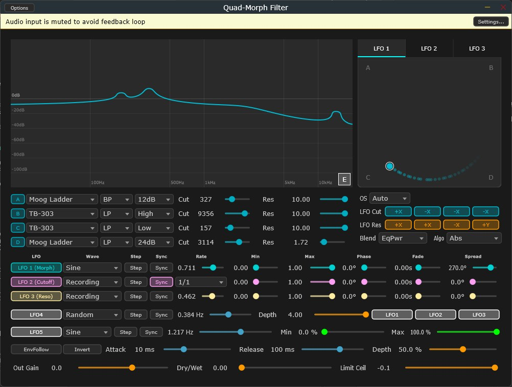

# Quad Morph Filter


---

## ⚠️ **IMPORTANT: Audio Safety Notice**

> **This plugin can generate LOUD audio output. HEARING PROTECTION IS YOUR RESPONSIBILITY.**
>
> * Always monitor output levels carefully when using speakers or headphones
> * Start with LOW volume and gradually increase
> * **NEVER wear headphones at maximum volume**
> * Take regular breaks during extended use
> * Prolonged exposure to loud sound (≥85 dB SPL) causes permanent hearing loss
> * By using this plugin, you assume FULL responsibility for your hearing safety and equipment protection
>
> **For detailed safety information, see the [Disclaimer](#%EF%B8%8F-disclaimer) section.**

---

##


## Overview

**Quad Morph Filter** is a high-performance, open-source VST3 plugin featuring **28 meticulously modeled filter algorithms** that can be morphed together in real-time using an intuitive XY pad interface. Designed for advanced sound design, electronic music production, and experimental audio processing, Quad Morph Filter delivers professional-grade DSP with research-backed filter implementations ranging from iconic analog classics (Moog Ladder, TB-303) to cutting-edge digital algorithms (Z-Plane morphing, Bode frequency shifter).

Morph up to **4 different filters simultaneously** with equal-power blending, control them via 19 LFO waveforms, record your own XY patterns, and explore infinite sonic territories — all in real time with extreme audio stability.

👉 **[Watch the Demo Video (動作デモ動画はこちら！)](https://youtu.be/REPLACE-WITH-YOUR-VIDEO-ID)**


## Key Features

### 🎛️ 28 Premium Filter Models

A comprehensive, handcrafted collection spanning 6 distinct filter architecture categories:

* **Ladder Filters (5 models):** Iconic analog emulations including **Moog Ladder**, **TB-303 Diode** (with Accent control), **Prophet CEM3320**, **Oberheim SSM 2040**, and **Roland Jupiter**.
* **SVF Precision (9 models):** High-precision State Variable Filters including **Clean SVF**, **SEM**, **Formant (Vowel)**, **Bitcrush/SRR**, **Comb Filter**, **MS-20 Screaming**, **Phaser**, **Wavefolder**, and **CS-80**.
* **Analog Emulation (4 models):** Sophisticated analog circuit simulators: **Vactrol LPG**, **Modal Resonator**, **Nyquist Anti-alias**, and **FDN Reverb** (4-delay feedback network).
* **Digital Precision (4 models):** Mathematically perfect digital filters: **Butterworth** (flat passband), **Chebyshev** (ripple), **Bessel** (linear phase), and **Elliptic** (notch stopband).
* **Spectral (5 models):** Advanced frequency-domain processing: **Kilo All-Pass** (16 stages), **Bode Frequency Shifter** (Hilbert transform), **Z-Plane 2D Morph**, **Phased Array**, and **Phaser 2**.
* **Experimental (1 model):** **All-Pass Phaser** for texture and ambient effects.

### 🌊 Real-Time XY Morphing Engine

* **4-Filter Simultaneous Blending:** Morph between up to 4 different filter models at once with seamless, zero-artifact equal-power crossfading.
* **4 Morph Blend Algorithms:** Choose your blending curve — **Equal Power** (classic constant-energy), **Linear** (bilinear crossfade), **Smoothstep** (S-curve bias), or **Radial** (inverse-distance weighting).
* **Live Frequency Response Visualizer:** Watch the composite filter curve update in real time as you morph. Disabled filters fade to silence (no -100dB artifacts).
* **Cutoff/Resonance Direct Control:** Switch modes to control Cutoff and Resonance directly via XY position rather than morphing filters.

### 🎚️ Advanced LFO System

**19 Waveforms:**
- Classic: Sine, Sawtooth, Pulse, Triangle
- Random: Random 1/2, White Noise, Smooth Noise
- Geometric: Spirograph, Torus Knot, Lissajous, Spiral, Star, Rose, Lemniscate
- Dynamic: Billiard (collision bouncing), Polygon, Lorenz/Henon Attractor
- Special: Recording (hand-drawn XY patterns)

**3 Independent LFO Systems + Modulation Engines:**
- **LFO1:** Morphing parameter modulation (XY position)
- **LFO2:** Cutoff frequency modulation
- **LFO3:** Resonance modulation
- **LFO4:** Rate Modulation (modulate LFO1/2/3 frequencies)
- **LFO5:** Dry/Wet Range Modulation (control mix amount via LFO)

**Precise Timing Control:**
* Tempo sync: 8/1 → 1/64 with Dot (1.5×) and Triplet (2/3×) variants
* Freeform rate: 0.01 – 20.0 Hz
* Per-LFO phase, fade-in time, and per-band spread controls

**Recording & Playback:**
* Draw custom XY patterns directly on the morph pad via mouse
* Tab-based LFO selection (LFO1/2/3) prevents recording confusion
* Real-time grid visualization during capture
* Lock-free atomic operations ensure audio thread safety

### 🔊 Professional Audio Features

* **Oversampling (4 modes):** Off / Auto / 2× / 4× — crucial for Moog and TB-303 models to suppress aliasing under high resonance.
* **Envelope Follower:** Sidechain-style input tracking with independent Attack, Release, Depth, and Invert controls.
* **Dry/Wet Mix:** Smooth linear interpolation of wet/dry blend (τ = 50 ms) eliminates zipper noise under automation.
* **Master Output Gain:** Professional-grade gain staging (-36 to +24 dB).
* **Limiter Ceiling:** Transparent RMS-tracking limiter with adjustable ceiling threshold.
* **Automatic Gain Compensation (AGC):** Moog and TB-303 models dynamically scale output to maintain perceived loudness under resonance boost.

### 🎨 Pro UI & Visualization

* **Ableton Live Medium-Dark Theme:** Seamlessly integrated dark aesthetic matching professional production environments.
* **Real-Time Frequency Response Graph:** 1024-point FFT display with 0 dB reference line, dB grid, and frequency markers (100 Hz, 1 kHz, 10 kHz).
* **E-Button (Background Randomizer):** Click to randomize GUI background color; right-click to reset to default.
* **LFO Tab Navigation:** Visual tabs to select which LFO is being edited or recorded — prevents accidental overwrites.
* **Parameter Smoothing:** All slider changes are interpolated to eliminate clicks and pops.

##


## Filter Models Guide

### Complete Model Reference

Quad Morph Filter ships with **28 handcrafted filter models**, each optimized for specific sonic characteristics. Select any combination of 4 filters to morph between:

| Model # | Name | Category | Type | Slope | Description |
|---|---|---|---|---|---|
| 0 | Clean SVF | SVF | LP/BP/HP/Notch | 12/24/48/96 dB/oct | Pristine state-variable filter, zero aliasing |
| 1 | Moog Ladder | Ladder | LP only | 24 dB/oct | Classic 4-pole tanh nonlinearity, Newton-Raphson iteration, ADAA |
| 2 | TB-303 Diode | Ladder | LP only | 24 dB/oct | Iconic acid synth filter with Accent Off/Low/High control |
| 3 | SEM (Oberheim) | SVF | LP/BP/HP/Notch | 24 dB/oct | Oberheim classic with soft clipping saturation |
| 4 | Bitcrush/SRR | SVF | LP/BP/HP/Notch | 24 dB/oct | Sample-rate reduction effect, ultra-lo-fi textures |
| 5 | Formant (Vowel) | SVF | LP/BP/HP/Notch | 24 dB/oct | 3-parallel SVF array for vowel morphing |
| 6 | Comb Filter | SVF | LP/BP/HP/Notch | 24 dB/oct | Delay-line comb with variable feedback |
| 7 | MS-20 Screaming | SVF | LP/BP/HP/Notch | 24 dB/oct | Korg MS-20 recreation with extreme resonance |
| 8 | All-Pass Phaser | Spectral | LP/BP/HP/Notch | 24 dB/oct | 16-stage all-pass network, subtle phasing |
| 9 | Wavefolder | SVF | LP/BP/HP/Notch | 24 dB/oct | Sine expansion with ADAA anti-aliasing |
| 10 | FDN Reverb | Experimental | LP/BP/HP/Notch | 24 dB/oct | 4-delay feedback network (Room/Hall/Cave/Plate) |
| 11 | Kilo All-Pass | Spectral | LP/BP/HP/Notch | 24 dB/oct | 16-stage all-pass cascade, dense modulation |
| 12 | CEM3320 (Prophet) | Ladder | LP only | 24 dB/oct | Curtis CEM3320 emulation with soft nonlinearity |
| 13 | SSM 2040 (OB) | Ladder | LP only | 24 dB/oct | Oberheim classic with asymmetric soft clipping |
| 14 | CS-80 (Yamaha) | SVF | LP/BP/HP/Notch | 24 dB/oct | Legendary polyphonic synth filter |
| 15 | Jupiter (Roland) | Ladder | LP only | 24 dB/oct | Roland SH-101 / Jupiter-8 diode ladder |
| 16 | Phased Array | Spectral | LP/BP/HP/Notch | 24 dB/oct | All-pass phasing with stereo width control |
| 17 | Butterworth | DigitalPrecision | LP/BP/HP/Notch | 12/24/48/96 dB/oct | Maximally flat passband response |
| 18 | Chebyshev | DigitalPrecision | LP/BP/HP/Notch | 12/24/48/96 dB/oct | Controlled passband ripple, sharp transition |
| 19 | Bessel | DigitalPrecision | LP/BP/HP/Notch | 12/24/48/96 dB/oct | Linear phase response, minimal ringing |
| 20 | Elliptic | DigitalPrecision | LP/BP/HP/Notch | 12/24/48/96 dB/oct | Equiripple passband/stopband, sharp edge |
| 21 | Vactrol LPG | AnalogEmulation | LP only | 12 dB/oct | LED-driven optical low-pass gate, vintage warmth |
| 22 | Modal Resonator | AnalogEmulation | LP/BP/HP/Notch | 24 dB/oct | 8 formant bands, speech-like textures |
| 23 | Waveguide Mesh | SVF | LP/BP/HP/Notch | 24 dB/oct | String synthesis mesh, metallic rings |
| 24 | Bode Frequency Shifter | Spectral | LP/BP/HP/Notch | N/A | Hilbert-transform-based frequency shift (±5 kHz) |
| 25 | Z-Plane 2D Morph | Spectral | LP/BP/HP/Notch | 24 dB/oct | 7-biquad pole-placement morphing |
| 26 | Phased Array 2 | Spectral | LP/BP/HP/Notch | 24 dB/oct | Advanced all-pass stereo decorrelation |
| 27 | Nyquist Anti-alias | AnalogEmulation | LP/HP | 12 dB/oct | Transparent high-frequency limiter |

### Cutoff Algorithms

Quad Morph Filter provides **3 cutoff calculation modes** to suit different workflows:

| Mode | Range | Description |
|---|---|---|
| **Absolute (Abs)** | 20 Hz – 20 kHz | Direct frequency position (20 Hz at left, 20 kHz at right) |
| **Relative (Rel)** | ±4 octaves | Center at XY midpoint; ±4 octaves from center |
| **Zone (Zone)** | Asymmetric | Different scaling for left/right regions (musical control) |


## LFO System Guide

### 19 LFO Waveforms

| # | Name | Category | Description |
|---|---|---|---|
| 1 | Sine | Classic | Pure sinusoid, smooth modulation |
| 2 | Sawtooth | Classic | Ramp up, bright metallic sweep |
| 3 | Pulse | Classic | Pulse wave, adjustable duty cycle |
| 4 | Triangle | Classic | Linear ramp, intermediate brightness |
| 5 | Random 1 | Random | Step-wise random jumps |
| 6 | Random 2 | Random | Smooth random interpolation |
| 7 | Noise | Random | White noise continuous modulation |
| 8 | Smooth Noise | Random | Hermite-interpolated noise, organic feel |
| 9 | Spirograph | Geometric | Epitrochoid pattern, spiral curves |
| 10 | Torus Knot | Geometric | 3D knot unwrap, complex topology |
| 11 | Lissajous | Geometric | 3:2 frequency ratio parametric curve |
| 12 | Spiral | Geometric | Logarithmic spiral, organic growth |
| 13 | Star | Geometric | Radial star pattern, rhythmic pulses |
| 14 | Rose | Geometric | Polar rose curve (Rhodonea), petals |
| 15 | Lemniscate | Geometric | Figure-8 infinity loop pattern |
| 16 | Billiard | Dynamic | Ball bouncing in a box, collision physics |
| 17 | Polygon | Dynamic | Step waveform with N-sided geometry |
| 18 | Attractor | Dynamic | Lorenz/Henon chaotic attractor, unpredictable |
| 19 | Recording | Special | Hand-drawn XY patterns from morph pad |

### LFO Controls (per LFO)

| Parameter | Range | Default | Description |
|---|---|---|---|
| Enable | On/Off | Off | Activate LFO modulation |
| Wave | 1–19 | Sine | Waveform selection |
| Step Mode | On/Off | Off | Quantize to steps instead of smooth sweep |
| Sync | On/Off | On | Lock to DAW tempo (vs. freeform) |
| Rate (Sync) | 8/1 – 1/64 | 1/4 | Tempo-synchronized note divisions |
| Rate (Free) | 0.01 – 20.0 Hz | 1.0 Hz | Freeform frequency (Hz) |
| Min | 0.0 – 1.0 | 0.0 | Lower modulation bound |
| Max | 0.0 – 1.0 | 1.0 | Upper modulation bound |
| Phase | 0° – 360° | 0° | LFO phase offset |
| Fade In | 0 – 10 s | 0 s | Fade-in time on plugin load |
| Spread | 0° – 360° | 0° | Per-filter phase offset (Spread) |

### LFO4: Rate Modulation

Modulate the playback rate of LFO1, LFO2, and LFO3 independently:

| Parameter | Range | Default | Description |
|---|---|---|---|
| Enable | On/Off | Off | Activate LFO4 |
| Wave | 1–19 | Sine | LFO4 waveform |
| Depth | 0 – 4.0 | 0 | Rate modulation amount (multiplication factor) |
| Assign to LFO1/2/3 | On/Off | Only LFO1 | Which LFO(s) to modulate |

### LFO5: Dry/Wet Range Modulation

Control the minimum and maximum mix level of the wet signal via LFO5:

| Parameter | Range | Default | Description |
|---|---|---|---|
| Enable | On/Off | Off | Activate LFO5 |
| Wave | 1–19 | Sine | LFO5 waveform |
| Min | 0 – 100% | 0% | Minimum wet level during LFO cycle |
| Max | 0 – 100% | 100% | Maximum wet level during LFO cycle |


## Parameter Reference

### Filter Parameters (per Filter A/B/C/D)

| Parameter | Range | Default | Description |
|---|---|---|---|
| Enable | On/Off | A: On / B,C,D: Off | Activate filter in morph blend |
| Model | 0 – 27 | A: 0 / B: 1 / C: 3 / D: 14 | Filter model selection |
| Type | LP / BP / HP / Notch | LP | Filter type |
| Slope | 12/24/48/96 dB/oct | 24 dB/oct | Filter steepness (not all models support all slopes) |
| Cutoff | 20 Hz – 20 kHz | 1000 Hz | Cutoff frequency (log scale) |
| Res / Ctrl | 0.1 – 10.0 | 0.707 | Resonance / Emphasis / Feedback |

### Morph & Blend

| Parameter | Range | Default | Description |
|---|---|---|---|
| Base X | 0.0 – 1.0 | 0.5 | XY pad X position (left = 0, right = 1) |
| Base Y | 0.0 – 1.0 | 0.5 | XY pad Y position (top = 0, bottom = 1) |
| Morph Blend | EqPwr / Linear / Smooth / Radial | EqPwr | Blending algorithm for 4-filter combination |
| Cutoff Algo | Abs / Rel / Zone | Abs | Cutoff frequency calculation mode |

### LFO Cut/Res Modulation (per Filter)

| Parameter | Range | Default | Description |
|---|---|---|---|
| LFO Cut Src | Off / +X / +Y / -X / -Y | Off | Cutoff modulation source from LFO2 |
| LFO Res Src | Off / +X / +Y / -X / -Y | Off | Resonance modulation source from LFO3 |

### Master Controls

| Parameter | Range | Default | Description |
|---|---|---|---|
| Output Gain | -36 – +24 dB | 0 dB | Master output level |
| Dry/Wet | 0 – 100% | 100% | Wet signal blend ratio |
| Limit Ceil | -36 – 0 dB | -0.1 dB | Output limiter ceiling threshold |
| OS Quality | Off / Auto / 2× / 4× | Auto | Oversampling mode (2× for Moog/TB-303) |

### Global Settings

| Parameter | Range | Default | Description |
|---|---|---|---|
| Envelope Follower Enable | On/Off | Off | Activate input envelope tracking |
| Envelope Attack | 1 – 500 ms | 10 ms | Envelope follower attack time |
| Envelope Release | 1 – 500 ms | 100 ms | Envelope follower release time |
| Envelope Depth | 0 – 100% | 50% | Envelope follower modulation amount |
| Envelope Invert | On/Off | Off | Invert envelope polarity |


## Installation

### VST3 Plugin Installation

1. Download the latest `QuadMorphFilter.vst3` from the [Releases](https://github.com/OTODESK4193/QuadMorphFilter/releases/latest) page.
2. Copy the `.vst3` folder to your VST3 plugin directory:
   ```
   C:\Program Files\Common Files\VST3\
   ```
3. Rescan your plugins in Ableton Live (or your DAW of choice).

### Standalone Application

A standalone executable is also provided — no DAW installation required. Simply run `Quad-Morph Filter.exe` directly.

## 📚 User Guide

Comprehensive user manuals covering detailed operation, advanced techniques, and DSP background are included with this repository.

[ -blue?style=for-the-badge&logo=markdown) ](Source/Assets/QuadMorphFilter_UserManual_JP.md)

[ -blue?style=for-the-badge&logo=markdown) ](Source/Assets/QuadMorphFilter_UserManual_EN.md)

### Build Requirements

* **JUCE** 8.0.x — place at `C:/JUCE` or update the path in `CMakeLists.txt`
* **CMake** 3.24 or higher
* **Visual Studio** 2022 (MSVC, C++20)
* **AVX2-capable CPU** (required for SIMD optimizations)
* **xsimd** 13.0.0 (included in JUCE modules)


## System Requirements

* **OS:** Windows 10 / Windows 11 (64-bit)
* **Format:** VST3 / Standalone
* **CPU:** AVX2 support required
* **RAM:** 256 MB minimum
* **Disk:** 50 MB for plugin + sample assets

> ⚠️ **Compatibility Notice:** This plugin is compiled and optimized exclusively for Windows 64-bit with AVX2. Verified operation is confirmed in **Ableton Live 11 / 12**. Other DAWs (FL Studio, Bitwig, Studio One, Cubase, Reaper, Logic Pro, etc.) may work but are currently unverified. Use at your own risk outside of Ableton Live.


## Technical Architecture

### Signal Flow Diagram

```
Stereo Input (L/R)
    │
    ├─► [Dry Buffer Cache]
    │
    ├─► [LFO Engine Processing] ────────────────────┐
    │   ├── LFO1 (Morph modulation)                  │
    │   ├── LFO2 (Cutoff modulation)                 │
    │   ├── LFO3 (Resonance modulation)              │
    │   ├── LFO4 (Rate modulation)                   │
    │   └── LFO5 (Dry/Wet modulation)                │
    │                                                 │
    ├─► [XY Position Calculation]                    │
    │   ├── Morph Blend Mode: 4-filter blend        │
    │   └── Cutoff Mode: Direct Cutoff/Reso         │
    │                                                 │
    ├─► [Enabled Filter Detection]                  │
    │   └── Count enabled filters (A/B/C/D)         │
    │                                                 │
    ├─► [Weight Mix Calculation] ◄───────────────────┘
    │   ├── if enabledCount ≤ 1: constant weights   │
    │   └── if enabledCount > 1: morphBlend algo    │
    │                                                 │
    ├─► [Per-Sample Filter Update]                  │
    │   ├── TptFilter A: Model selection            │
    │   ├── TptFilter B: Cutoff/Reso modulation     │
    │   ├── TptFilter C: Envelope Follower (opt)    │
    │   └── TptFilter D: Oversampling (2×/4×)       │
    │                                                 │
    ├─► [Parallel Filter Processing]                │
    │   ├── FilterA_SVF_SIMD (AVX2)                 │
    │   ├── FilterB (TptFilter dispatcher)          │
    │   ├── FilterC (TptFilter dispatcher)          │
    │   └── FilterD (TptFilter dispatcher)          │
    │                                                 │
    ├─► [4-Filter Weighted Sum]                     │
    │   └── Output = wA×A + wB×B + wC×C + wD×D     │
    │                                                 │
    ├─► [Dry/Wet Smooth Crossfade]                  │
    │   └── Linear interpolation (τ = 50 ms)        │
    │                                                 │
    ├─► [Master Gain + Limiter]                     │
    │   ├── Output gain (dB)                         │
    │   └── RMS-tracking brick-wall limiter         │
    │                                                 │
    └─► Stereo Output (L/R)
```

### Core DSP Components

| Component | Purpose |
|---|---|
| **LfoEngine** | 19 waveform generation, tempo sync, recording playback |
| **TptFilter** | 28-model dispatcher with per-model coefficient management |
| **FilterA_SVF_SIMD** | AVX2-optimized Clean SVF (4 parallel, 24dB/oct) |
| **MorphEngine** | 4-way equal-power blend algorithms |
| **FilterVisualizer** | Real-time 1024-point frequency response display |
| **XYPadComponent** | Morph control, LFO tab navigation, Recording grid |

### Real-Time Safety

Quad Morph Filter adheres to the strictest real-time audio constraints:

* **Zero Heap Allocation on Audio Thread:** All buffers pre-allocated in `prepareToPlay()`. No dynamic memory operations in `processBlock()`.
* **Lock-Free Parameter Dispatch:** Smart parameter caching prevents unnecessary DSP recalculation.
* **ScopedNoDenormals:** Applied at `processBlock` entry to suppress denormal CPU spikes.
* **SmoothedValue Automation:** Gain changes interpolated sample-by-sample to eliminate zipper noise.
* **Safe Timer Management:** `stopTimer()` explicitly called in UI component destructors to prevent DAW cleanup-order crashes.


## ⚠️ Disclaimer

### Software Warranty

This software is provided "as-is", without any warranty of any kind. While extreme care has been taken to ensure real-time safety, audio stability, and Ableton Live compatibility through rigorous testing and professional DSP practices, unexpected behavior may still occur in edge cases or unsupported hosts. Use at your own risk in mission-critical production environments.

### 🔊 Audio Output & Hearing Protection — Critical Notice

**This plugin can generate loud audio output. User bears sole responsibility for safe audio monitoring.**

* **HEARING DAMAGE RISK:** Prolonged exposure to loud sound (≥85 dB SPL) can cause permanent hearing loss. This risk applies regardless of equipment type or volume settings.

* **SPEAKER / HEADPHONE USE:** Always monitor output levels carefully when using speakers or headphones. Start with low volume and gradually increase. Never wear headphones at maximum volume. Take regular breaks during extended use.

* **SELF RESPONSIBILITY:** The user assumes complete and exclusive responsibility for:
  - Setting appropriate monitoring levels
  - Protecting their own hearing and that of others
  - Equipment safety and damage risk
  - All consequences of audio output usage

* **NO LIABILITY:** The developer(s) and distributor(s) of this software assume no liability for:
  - Hearing loss, tinnitus, or any physical harm
  - Equipment damage due to audio output
  - Any injury or damage caused by improper use

* **USE AT YOUR OWN RISK:** By using this plugin, you acknowledge and accept all audio-related risks inherent to audio production software. If you are sensitive to loud sounds or have any hearing condition, consult an audio professional or medical advisor before use.

---

**Your hearing is irreplaceable. Prioritize hearing protection at all times.** 🎧


## License

This project is free and open-source, distributed under the **GPLv3 License** (inherited via the JUCE framework). You are free to study, modify, and redistribute the source code under the same terms.


## Credits

**Developer:** @OTODESK

**Music Production Background:** Electronic Music, Sound Design, DSP Engineering, JUCE plugin development

**Target DAW:** Ableton Live 11 / 12

**Framework:** JUCE 8.0.x

**DSP References:**
- Välimäki & Liski — *"Accurate Cascade Graphic Equalizer"* (2017)
- Vicanek — *"Matched Second Order Digital Filters"* (2016)
- Schattschneider & Zölzer — *"New methods for pitch shifting and time stretching"* (2014)
- Schlecht & Habets — *"On Lossless Feedback Delay Networks"* (2017)
- Parker et al. — *"Modelling plate and spring reverberation using DSP-informed DNN"* (2019)


## Support

* **Social / Demo:** [@OTODESK](https://x.com/kijyoumusic)
* [](https://otodesk4193.github.io/OTODESK_SITE/)

---

**Happy Morphing! 🎵**
